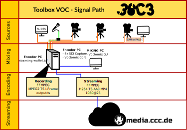
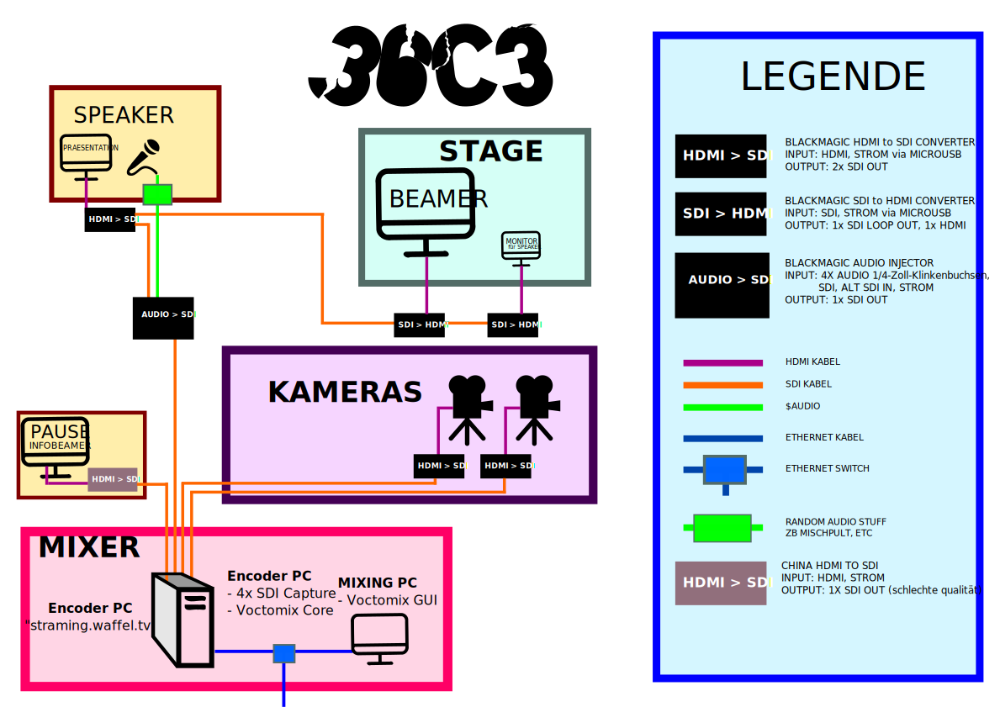

 Video Streaming am 36c3
==========================

Am 36c3 ist dies das Video Setup des [OIO](https://oio.social)

Eine Übersicht, was für Hardware hierfür mitkommt, gibt es auf [overview/36c3/INVENTORY.md](https://github.com/chaos-bodensee/voc-setup/blob/master/overview/36c3/INVENTORY.md).

Für technische Fragen an das Setup bitte an [Adorfer](https://wiki.freifunk.net/Benutzer:Adorfer) oder [L3D](https://doku.ccc.de/Benutzer:L3D) wenden.

## Signal path
*Von wo nach wo geht das Kamerasignnal?*


### Geräteeinsatz
*Wo wird welches Gerät eingesetzt?*



 Change configuration?
-----------------
To deploy new configuration via ansible, simple run the ``site.yml` from the root of this git repository:
```
pip3 install --user ansible
ansible-playbook site.yml
```

**DON'T FORGET TO COMMIT AND PUSH YOUR CHANGES!**

To modify the voctomix (core or gui) config, do it in this repo:
https://github.com/chaos-bodensee/voc-config.git
